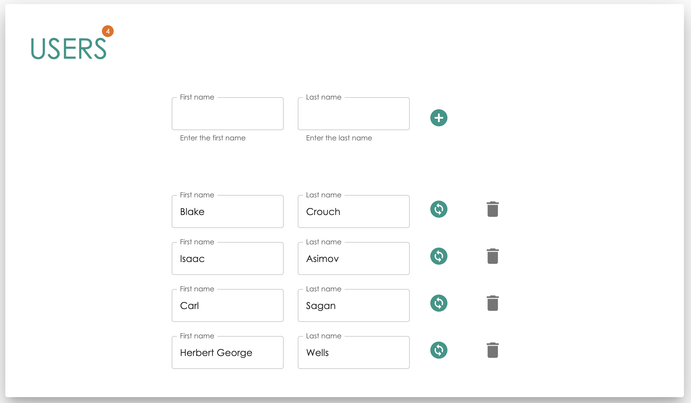

# CRUD - ReactJS, NodeJS, MySQL
This is a single page application implemented with ReactJS, NodeJS and MySQL by using PedroTech's 3 part series tutorial. In addition, <a href="https://mui.com/" targe="_blank">Material UI</a> was used to beautify the frontend.

## Create from scratch with tutorial
<ol>
<li><a href="https://www.youtube.com/watch?v=T8mqZZ0r-RA" target="_blank">CRUD Tutorial - ReactJS, NodeJS, MySQL [Part 1]</a></li>
<li><a href="https://www.youtube.com/watch?v=3YrOOia3-mo" target="_blank">CRUD Tutorial - ReactJS, NodeJS, MySQL [Part 2]</a></li>
<li><a href="https://www.youtube.com/watch?v=_S2GKnFpdtE" target="_blank">CRUD Tutorial - ReactJS, NodeJS, MySQL [Part 3]</a></li>
</ol>

## Some of the commands from the tutorial to copy and paste

### Create folders
<ol>
  <li><code>mkdir crud-with-react</code></li>
  <li><code>cd crud-with-react</code></li>
  <li><code>mkdir frontend backend</code></li>
  </ol>

### Frontend
<ol>
  <li><code>cd frontend</code></li>
  <li>Create a new React app: <code>npx create-react-app .</code></li>
  <li>Install libraries: <code>npm i axios @mui/material @mui/styled-engine-sc styled-components @emotion/react @emotion/styled @mui/icons-material</code></li>
  <li>Run the app: <code>npm start</code></li>
</ol>

### Backend
<ol>
  <li><code>cd backend</code></li>
  <li><code>npm init</code></li>
  <li>Install libraries: <code>npm install express body-parser mysql nodemon cors</code></li>
  <li>Create an index.js file: <code>touch index.js</code></li>
  <li>Run: 
    <ul>
      <li><code>node index.js</code> or</li>
      <li>Add start and devStart to package.json and then <code>npm run devStart</code></li>
    </ul>
  </li>
</ol>
